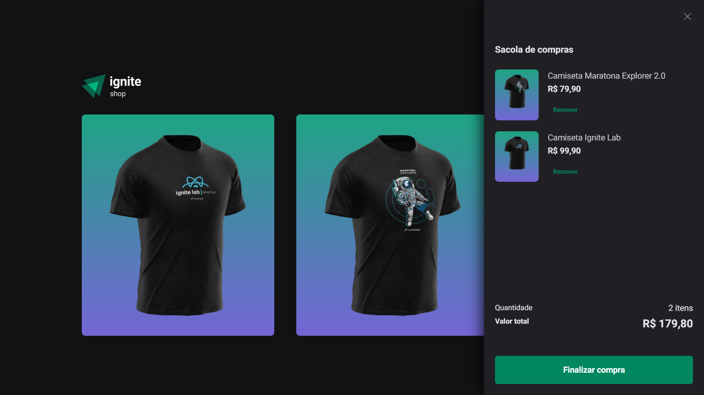

# Ignite Shop - E-Commerce de Camisetas Rocketseat

Ignite Shop, uma plataforma de e-commerce para comprar camisetas temáticas da Rocketseat. Este projeto é construído utilizando tecnologias web modernas, como Next.js, Stripe para o checkout, useShoppingCart para funcionalidade do carrinho, Stitches para estilização, Axios para requisições à API e TypeScript para desenvolvimento com tipagem segura.

<div align="center">
  
</div>

## Índice

- [Começando](#começando)
  - [Pré-requisitos](#pré-requisitos)
  - [Instalação](#instalação)
  - [Configuração](#configuração)
- [Recursos](#recursos)
  - [Renderização do Lado do Servidor (SSR) e Geração de Site Estático (SSG)](#renderização-do-lado-do-servidor-ssr-e-geração-de-site-estático-ssg)
  - [Integração com o Stripe](#integração-com-o-stripe)
  - [Funcionalidade do Carrinho](#funcionalidade-do-carrinho)
  - [Estilização com Stitches](#estilização-com-stitches)
- [Uso](#uso)

## Começando

Siga estas instruções para configurar o projeto em sua máquina local.

### Pré-requisitos

Certifique-se de que você tenha o seguinte instalado:

- Node.js (versão 14 ou superior)
- npm ou yarn
- Conta no Stripe para as chaves da API

### Instalação

1. Clone o repositório:

```bash
git clone https://github.com/seu-nome-de-usuário/ignite-shop.git
```

2. Navegue até o diretório do projeto:

```bash
cd ignite-shop
```

3. Instale as dependências usando npm ou yarn:

```bash
npm install
# ou
yarn install
```

### Configuração

Renomeie o arquivo .env.example para .env.local e atualize as variáveis de ambiente:
```dotenv
STRIPE_PUBLIC_KEY=sua_chave_pública_do_stripe
STRIPE_SECRET_KEY=sua_chave_secreta_do_stripe
```

### Recursos
#### Renderização do Lado do Servidor (SSR) e Geração de Site Estático (SSG)
O projeto utiliza o Next.js para implementar a Renderização do Lado do Servidor (SSR) e a Geração de Site Estático (SSG) para melhorar o desempenho e o SEO.

#### Integração com o Stripe
O Stripe está integrado para um checkout seguro e sem problemas. Os clientes podem inserir com segurança seus detalhes de pagamento e concluir seus pedidos.

#### Funcionalidade do Carrinho
A biblioteca useShoppingCart é usada para gerenciar a funcionalidade do carrinho de compras. Os usuários podem adicionar e remover itens em seu carrinho antes de prosseguir para o checkout.

#### Estilização com Stitches
O Stitches, uma biblioteca CSS-in-JS, é usado para estilizar os componentes. Essa abordagem oferece melhor encapsulamento e manutenção para a estilização.

### Uso

1. Faça e execute a build para melhor uso:
```bash
npm run build
npm start
# ou
yarn build
yarn start
```

2. Abra seu navegador e acesse http://localhost:3000 para acessar o Ignite Shop.